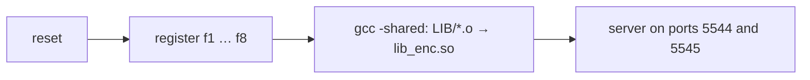
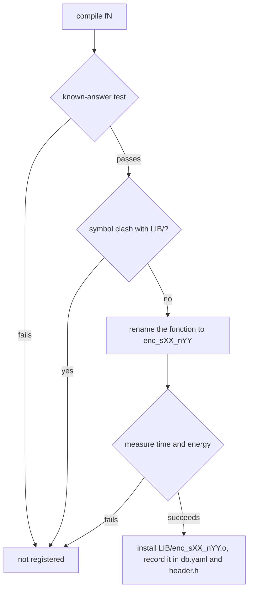
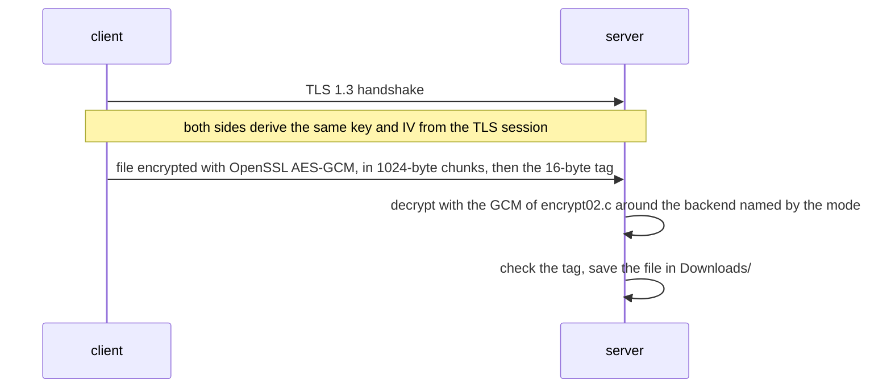

# myrtus-psm-edge — Privacy and Security Manager (Edge Layer)

Crypto-agile TLS prototype with eight runtime-selectable AES backends, running on ARM64 edge hardware and on x86-64. Component of the **MYRTUS** project (Horizon Europe, Grant No. 101135183).

|  |  |
|---|---|
| **Repository** | https://github.com/mdc-suite/myrtus-psm-edge |
| **Upstream** | https://github.com/subhadeep-banik/spdocker |
| **Target hardware** | AMD/Xilinx Kria KV260 — Zynq UltraScale+ MPSoC, 4× Cortex-A53, aarch64, Ubuntu 22.04 IoT |
| **Hosts** | the board itself (native aarch64 build) · bare-metal x86-64 Linux (native amd64 build) |
| **Base image** | [`al3monni/kria-ubuntu:22.04.5`](https://hub.docker.com/r/al3monni/kria-ubuntu) on aarch64, `ubuntu:22.04` on x86-64, chosen automatically |
| **Status** | ✅ Validated on both architectures: eight backends registered and measured, byte-identical round trips on both security levels |

> Derived from [spdocker](https://github.com/subhadeep-banik/spdocker) by Subhadeep Banik. Every modification made along the way, and why, is recorded in [`LOGBOOK.md`](LOGBOOK.md).

---

## What this is

A TLS client/server that ships **eight interchangeable AES implementations**. The implementation protecting a file transfer is not fixed at compile time: the server picks one at runtime, loads it from a shared library through `dlopen`/`dlsym`, and uses it for the authenticated encryption of the transfer.

That is what *crypto-agility* means here, and it is the reason this component sits in the MYRTUS edge layer as the Privacy and Security Manager: the security/performance/energy trade-off of a secure channel can be renegotiated while the node is running, rather than being frozen when the binary was built.

The eight backends span two security levels (AES-128 and AES-256) and four implementation strategies for each: reference C, an alternative C implementation, a bitsliced constant-time version, and one that uses the processor's own AES instructions.

---

## How it works

Everything runs inside one container. This section follows the execution from the moment the container starts to the moment a file is received, and then shows how the backend is switched at runtime.

### 1. Container start

`start.sh` is the container's entrypoint. It runs four steps:



1. **`reset`** empties `LIB/`, rewrites `header.h` with zero backends per level, and empties `db.yaml`.
2. **`register`** runs once per backend, `f1` to `f8`, in that order (next section).
3. **`gcc -shared`** links the registered objects into one library, `LIB/lib_enc.so`.
4. **`server`** starts, after `start.sh` has created `Downloads/`, where received files are saved.

### 2. Registering a backend

Each backend directory holds its source, its Makefile and a `config.txt` naming the security level, the source file and the AES function. `register -c ./fN/config.txt` takes the backend through a sequence of checks, and a backend that fails any of them is simply not registered:



- **Known-answer test.** `register` fills a template (`check1.c` for AES-128, `check2.c` for AES-256) with a call to the backend, compiles it with the backend's object and runs it: the backend must encrypt a fixed plaintext under a fixed key into the expected ciphertext. This is what proves that a backend computes AES correctly.
- **Symbol clash.** Every backend ends up in the same library, so `register` checks with `nm` that none of its symbols already exists in `LIB/`.
- **Rename.** `gen.c` wraps the source with `#define <function> enc_sXX_nYY` and recompiles it: `XX` is the security level and `YY` the next free index for that level, read from `header.h`. The registration order therefore *is* the numbering.
- **Measurement.** `profile01.c` measures the backend and appends its time and energy, per 50 000 encryptions, to `db.yaml`:
  - on **x86-64**, with `likwid-perfctr -g ENERGY` around 50 000 encryptions, reading the RAPL energy of the processor cores;
  - on the **board**, with the module's INA260 power monitor: 2 s of idle, 3 s of the backend looping, 2 s of idle again, and the energy above idle integrated over the run.
- **Install.** The object stays in `LIB/` only if the measurement succeeds; then the counter in `header.h` is incremented and the backend's prototype added. On any failure `header.h` is left as it was.

The result, for each level, is four backends numbered `n01` to `n04`:

| Level | `n01` | `n02` | `n03` | `n04` |
|---|---|---|---|---|
| 1 — AES-128 | f1, reference C | f2, alternative C | f3, bitsliced | f7, AES instructions |
| 2 — AES-256 | f4, reference C | f5, alternative C | f6, bitsliced | f8, AES instructions |

### 3. The server

The server prints the OpenSSL banner and forks into two processes, one per security level:

| Port | Level | Cipher expected from the client | Initial backend |
|---|---|---|---|
| 5544 | high | AES-256-GCM | `enc_s02_n02` (f5) |
| 5545 | low | AES-128-GCM | `enc_s01_n02` (f2) |

Each process keeps the backend it uses in a single byte, the **mode**: two bits for the function, two for the security level, four for the implementation index. `0x62` = `01 10 0010` means encryption, level 2, index 2, i.e. `enc_s02_n02`.

### 4. A file transfer



1. The client (`./client -s <level> -i <address>:<port> -f <file>`) connects to the port of the chosen level: `-s 1` to 5544, `-s 0` to 5545.
2. After the TLS 1.3 handshake, both sides call `SSL_export_keying_material` and obtain the same 64 bytes: the key and the IV of the file encryption. Nothing else about the cipher is negotiated.
3. The client encrypts the file with OpenSSL's AES-GCM (256-bit on 5544, 128-bit on 5545) and sends it in 1024-byte chunks, followed by the 16-byte authentication tag. It prints `Entire File Sent <n> bytes`.
4. The server decrypts with its own GCM implementation (`encrypt02.c`), which calls the backend named by the mode for every AES block, verifies the tag at the end and saves the file as `Downloads/filename-ekm<N>`.

The client always uses OpenSSL and knows nothing about the mode. It does not need to: every backend of a level computes the same AES, so any of them decrypts what the client sends. **Changing implementation is invisible on the wire; changing level is not.**

### 5. Switching backend at runtime

This is the crypto-agility itself:

1. `./synthesize -f e -s <level> -t <0|1|2> -e <0|1|2>` reads `db.yaml`, keeps the four backends of the level, and picks the one closest to the requested time and energy (0 = lowest, 1 = middle, 2 = highest).
2. It calls `./send <port> <mode>`, which finds the server process listening on the port of that level and sends it the new mode with a `SIGUSR1` signal.
3. The server's signal handler stores the new mode. The backend is looked up again for every 1024-byte chunk, so the switch applies from the next chunk, even in the middle of a transfer, and lasts until the container restarts.

Nothing runs `synthesize` automatically: today the selection is a manual step.

### What lives where

| Path | Contents |
|---|---|
| `src/start.sh` | the container entrypoint: the pipeline of §1 |
| `src/reset.c`, `src/register.c`, `src/gen.c` | registration (§2) |
| `src/check1.c`, `src/check2.c` | the known-answer test templates, AES-128 and AES-256 |
| `src/profile01.c`, `src/internalprofile.c`, `src/ina260.h` | measurement: likwid and RAPL on x86-64, the INA260 on the board |
| `src/server_f.c`, `src/cltest.c`, `src/Makefile`, `src/makeclient` | server and client, and their build (§3, §4) |
| `src/encrypt02.c` | the GCM mode around the selected backend, and the mode decoding |
| `src/synthesize.c`, `src/send.c` | backend selection and delivery of the new mode (§5) |
| `backends/f1` … `backends/f8` | the eight AES backends, one directory each, with their own Makefile and `config.txt` |
| `certs/` | the server's self-signed test certificate and its key |
| `test/rfile` | the 10000-byte input of the round-trip test |
| `tools/` | `bench_ina260.sh`, unattended measurement campaigns on the board, and `ina260_test.c`, a check of the power sensor |
| `Dockerfile`, `compose-server.yml` | image definition and orchestration |

Inside the container everything is flat in `/app`: the Dockerfile copies `src/`, `backends/`, `certs/`, `test/rfile` and `tools/ina260_test.c` there, so `backends/f1` becomes `/app/f1` and `test/rfile` becomes `/app/rfile`. `LIB/`, `header.h`, `db.yaml` and `Downloads/` are created at runtime and are never committed. Every path in the commands below is a path in the container.

---

## Requirements

### On the board

An AMD/Xilinx Kria KV260 running Ubuntu 22.04 IoT, with Docker Engine installed. Full bring-up instructions — flashing, serial console, networking, Docker — are in [`KRIA_KV260_DEPLOYMENT.md`](KRIA_KV260_DEPLOYMENT.md).

Check that your user is in the `docker` group (`docker version` should respond without `sudo`), and that the microSD has several GB free: the base image alone is around 2 GB compressed.

### On an x86-64 host (bare metal)

x86-64 needs bare-metal Linux with Docker Engine. Every backend is measured when it registers, and one that cannot be measured is not registered: under WSL2, Docker Desktop or a virtual machine likwid finds no RAPL registers, so the image builds but no backend registers. On bare metal:

- **Secure Boot disabled.** With Secure Boot on, the kernel refuses raw MSR access and likwid cannot start its counters; `cat /sys/kernel/security/lockdown` must read `[none]`. On a machine that dual-boots Windows with BitLocker, have the recovery key ready before changing the setting.
- **The `msr` module loaded**, after every boot: `sudo modprobe msr` (or add `msr` to `/etc/modules-load.d/`).

`LOGBOOK.md` §5b has the checks, including how to confirm from inside the container that likwid reads the `ENERGY` group.

Each host builds for its own architecture, and all eight backends build on both: `f7` and `f8` carry both AES implementations and pick one at compile time, AES-NI on x86-64 and the ARMv8 Crypto Extensions on the Kria. There is no cross-build: the aarch64 image is built on the board itself.

---

## Build and run

### On the board

```bash
git clone https://github.com/mdc-suite/myrtus-psm-edge.git
cd myrtus-psm-edge

docker compose -f compose-server.yml up --build
```

A clean first build takes roughly ten minutes on the KV260, most of it compiling likwid. Later builds reuse that layer and finish in seconds.

### On an x86-64 host

The same command, with no build argument: the Dockerfile picks `ubuntu:22.04` as the base on x86-64.

```bash
sudo modprobe msr
docker compose -f compose-server.yml up --build
```

### What a successful start looks like

```
Resetting Initial Configuration
Registering Implementation in ./f1
...
Registering Implementation in ./f8
Done
Creating Shared Library lib_enc.so
Updating Paths
OpenSSL 3.0.2 15 Mar 2022 (Library: OpenSSL 3.0.2 15 Mar 2022)
platform: debian-arm64
```

Two things to check in that output: `Creating Shared Library` is not followed by an `ld` error, and the platform matches the host — `debian-arm64` on the board, `debian-amd64` on x86-64.

The `Registering Implementation` lines are printed whatever happens, because `start.sh` discards the output of each registration. Whether all eight backends registered is checked in the tests below, not read from the log.

### Running in the background

`up` stays attached to the terminal, which is handy for a first check; `Ctrl-C` stops the container. Once the start looks right, run it **detached** with `-d`:

```bash
docker compose -f compose-server.yml up -d --build   # starts in the background and returns the prompt
docker logs -f Test-server                           # follow the log; Ctrl-C stops following, not the container
docker compose -f compose-server.yml down            # stop and remove the container
```

The compose file sets `restart: unless-stopped`, so a detached container comes back by itself after a reboot, until it is stopped with `down`.

---

## Tests

There are three layers of tests: the ones the pipeline runs by itself at every start, the checks you run once the container is up, and the end-to-end tests of transfers and backend switching.

> [!NOTE]
> Compose calls the service `ssl-server`, and the container it creates is `Test-server`. `docker compose` subcommands take the service name; `docker exec` and `docker logs` take the container name.

### Built into every start

| Test | Where | What a failure means |
|---|---|---|
| Known-answer test | `register`, per backend | the backend does not compute AES correctly: not registered |
| Symbol clash | `register`, per backend | the backend would overwrite another one in the library: not registered |
| Measurement | `profile01.c`, per backend | time or energy could not be measured: not registered |
| Quality gate (board only) | `profile01.c`, per measurement | the idle baselines or the two halves of the run disagree by more than 15 mW: the measurement is repeated, up to three times, and the cleanest attempt is kept |

A failure in any of them removes one backend and nothing else, silently. The checks below are how you notice.

### After the start

**1. The binaries match the host.**

```bash
docker exec Test-server readelf -h /app/server | grep Machine
```

Expected: `AArch64` on the board, `Advanced Micro Devices X86-64` on x86-64.

**2. All eight backends are installed.**

```bash
docker exec Test-server ls -la /app/LIB
```

Expected: eight objects `enc_s01_n01` … `enc_s02_n04`, plus `lib_enc.so`. Eight is the number that matters: a backend refused by any of the tests above is missing here, and `register` does not report it.

**3. All eight symbols are exported.**

```bash
docker exec Test-server sh -c 'nm -D /app/LIB/lib_enc.so | grep enc_s'
```

Expected: eight entries, all of type `T`.

**4. The counters are right.**

```bash
docker exec Test-server sh -c 'grep "///" /app/header.h'
```

Expected: `///1-04` and `///2-04`, four backends at each security level.

**5. Every backend was measured.**

```bash
docker exec Test-server sh -c 'grep -c "^name" /app/db.yaml; grep -c "energy: 0.000000" /app/db.yaml'
```

Expected: `8` and `0`, eight entries and none with zero energy.

**6. The server is listening.**

```bash
docker exec Test-server sh -c 'lsof -i -P -n | grep LISTEN'
```

Expected: TCP `*:5544` and `*:5545`.

### Round trip on both security levels

This is the test that proves correctness. `rfile` is a 10000-byte file committed for the purpose. Send it once per level and compare what the server saved byte for byte:

```bash
for p in "1 5544" "0 5545"; do set -- $p
  docker exec Test-server sh -c "cd /app && rm -f Downloads/*; ./client -s $1 -i 127.0.0.1:$2 -f rfile 2>&1 | tail -1; sleep 3; for f in Downloads/*; do cmp rfile \$f && echo IDENTICAL -s $1 port $2; done"
done
docker logs Test-server 2>&1 | grep -E "Starting with|MISMATCH"
```

Expected, for each level: `Entire File Sent 10016 bytes` (10000 bytes of payload plus the 16-byte tag), then `IDENTICAL`. In the log, `Starting with enc_s02_n02` and `Starting with enc_s01_n02`, and no `TAG MISMATCH`.

A few things to know about this test:

- `-s` accepts only `1` and `0`. Any other value leaves the client without a cipher, and the server reports `TAG MISMATCH`.
- Run transfers one at a time. The two server processes draw the same sequence of random file names, so simultaneous transfers on the two ports can end up in the same file.
- `cmp` is the only trustworthy check. The client's `Entire File Sent` says nothing about what the server did with the data, the server's own "Received N bytes" line leaves out the last partial chunk, and the server keeps a file even when its tag does not verify (see *Known limitations*).

### Switching backend at runtime

This test exercises the crypto-agility: ask for the fastest and cheapest AES-128 backend, check that the server switches to it, and send a file through it.

```bash
docker exec Test-server sh -c 'cd /app && ./synthesize -f e -s 1 -t 0 -e 0'
docker logs --tail 3 Test-server
docker exec Test-server sh -c "cd /app && rm -f Downloads/*; ./client -s 0 -i 127.0.0.1:5545 -f rfile 2>&1 | tail -1; sleep 3; for f in Downloads/*; do cmp rfile \$f && echo IDENTICAL; done"
docker logs --tail 10 Test-server | grep "Starting with"
```

Expected:
- `synthesize` prints `enc_s01_n04` and `./send 5545 84` (84 = `0x54`: encryption, level 1, index 4), and `send` reports the process it signalled. The lines of `send` usually come out first: `synthesize` prints through a buffer that is emptied only when it exits;
- the server log shows `Recieved signal 84` and `Switching to enc_s01_n04`;
- the transfer is `IDENTICAL`, and the log reads `Starting with enc_s01_n04`.

The new backend stays in use until the container restarts. To go back to the initial one without restarting: `docker exec Test-server sh -c 'cd /app && ./send 5545 82'`.

---

## Known limitations

**Energy is measured differently on the two platforms, on purpose.** Each platform is measured with the finest instrument it offers: RAPL's per-core energy on x86-64, and on the board the INA260, which sees the whole module and gives the energy a backend draws above idle. The rankings of the backends agree across platforms; the joules cannot be compared. The selection is not affected, because `synthesize` compares backends only with each other, on one machine. `LOGBOOK.md` §9 explains the choice and its consequences.

**Energy differences below ~1% are not resolved on the board.** A single measurement varies by 1–3%. Backends further apart than that rank consistently; `enc_s02_n01` and `enc_s02_n02`, 0.1% apart, alternate between runs, which is the honest answer of the sensor.

**Measurement on the board wants a quiet board.** Anything else running on the module shows up in the reading. The code defends itself (robust estimator, quality gate), but for reference-grade figures stop the periodic system timers (`unattended-upgrades`, `anacron`, `dpkg-db-backup`, `logrotate`) for the duration, and never poll the container with `docker exec` while it measures. Every measurement attempt is logged in `power.csv`, next to `db.yaml`.

**Two cosmetic reporting bugs**, inherited from upstream: the server's received-byte counter drops the last partial chunk, and the transfer rate divides by an elapsed time that rounds to zero. Neither affects the data.

**The test certificate is not verified.** The server presents a self-signed certificate (`certs/certfile.crt`, valid until 18 January 2027), and the client does not check it. Its expiry will not break transfers, but the client does not authenticate the server either.

**Two weaknesses inherited from upstream, left open.** Neither affects normal operation. `./send` accepts a mode of the wrong security level: `./send 5545 98` puts the low-level port on an AES-256 backend, and every transfer on it breaks; `./synthesize` never does this. And the server writes decrypted data as it arrives and checks the authentication tag only at the end: on a mismatch it keeps the file and does not tell the client. `LOGBOOK.md` §10 describes both and how they could be closed.

---

## Base image

On aarch64 the container builds on [`al3monni/kria-ubuntu:22.04.5`](https://hub.docker.com/r/al3monni/kria-ubuntu), a snapshot of a Kria board's own root filesystem published to Docker Hub (`linux/arm64/v8`, ~2 GB compressed). On x86-64 it builds on stock `ubuntu:22.04`, the same release. The Dockerfile picks the base from the build architecture; there is no argument to pass.

Stock `ubuntu:22.04` is the same distribution but not the same userspace: AMD's Kria image carries board-specific tooling, such as `xmutil` and the platform-statistics utilities. Building on a frozen snapshot also means the toolchain does not depend on what happens to be installed on the board at build time.

Nothing about the application is baked into that snapshot: every build step lives in the tracked `Dockerfile`. The procedure for regenerating and republishing the image, including the exclusion mistakes that are easy to make, is in [`LOGBOOK.md`](LOGBOOK.md) §12.

---

## Credits and licence

This work is a port and extension of [spdocker](https://github.com/subhadeep-banik/spdocker) by Subhadeep Banik. See `LICENSE` for the original terms.

The bitsliced backends (`backends/f3`, `backends/f6`) come from [bitsliced-aes](https://github.com/conorpp/bitsliced-aes) by Conor Patrick, whose repository declares no licence.

The base image derives from AMD/Xilinx's Ubuntu 22.04 IoT image for Kria and contains Canonical- and AMD-licensed components, redistributed under their respective terms.

Funded by the European Union under Horizon Europe, Grant No. 101135183 (MYRTUS). Views and opinions expressed are those of the authors only and do not necessarily reflect those of the European Union.
